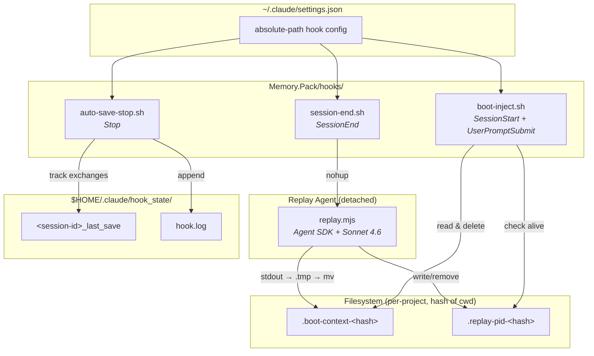
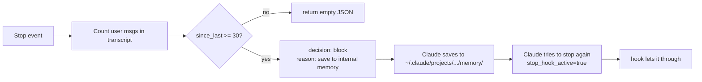

# Memory Pack Flow

## Session lifecycle

```mermaid
sequenceDiagram
    participant S1 as Session N (ending)
    participant SE as session-end.sh
    participant R as replay.mjs (nohup)
    participant F as Filesystem
    participant S2 as Session N+1 (starting)
    participant BI as boot-inject.sh

    Note over S1: Session ends

    S1->>SE: SessionEnd event<br/>(session_id, transcript_path, cwd)
    SE->>SE: Count user turns in transcript
    alt turns <= 5
        SE--xSE: exit (trivial session)
    end
    SE->>SE: hash cwd → PROJECT_HASH
    SE->>F: rm stale .boot-context-&lt;hash&gt; / .replay-pid-&lt;hash&gt;
    SE->>R: nohup detach (exits in <1.5s)
    R->>F: Write PID to .replay-pid-&lt;hash&gt;

    Note over R: Runs after session closes

    R->>R: getSessionMessages() via Agent SDK
    R->>R: Sonnet 4.6 summarizes<br/>(TITLE, SUMMARY, TODO, DECISIONS)
    R->>F: stdout → .boot-context-&lt;hash&gt;.tmp
    R->>F: atomic mv → .boot-context-&lt;hash&gt;
    R->>F: rm .replay-pid-&lt;hash&gt;

    Note over S2: Next session starts (same cwd → same hash)

    S2->>BI: SessionStart event
    BI->>BI: hash cwd → PROJECT_HASH
    alt .boot-context-&lt;hash&gt; exists
        BI->>F: read & delete
        BI->>S2: inject "[Boot context loaded…]" + body
    else replay still running
        BI->>S2: inject "[Previous session replay is still processing.]"
    else
        BI->>S2: inject "[No boot context available from previous session.]"
    end

    Note over S2: User submits first prompt

    S2->>BI: UserPromptSubmit event (fallback)
    alt boot context not ready & replay running
        BI->>BI: poll up to 5s
    end
    BI->>S2: inject context if now available
```

## Component overview



## auto-save Stop loop



## Wiring

Hooks are invoked by absolute path from `~/.claude/settings.json`, so the
`Memory.Pack/hooks/` directory is the single source of truth — there are no
per-project symlinks. The only per-project bit of state is the `cwd` hash
that scopes the boot-context and PID files inside `hooks/`.
